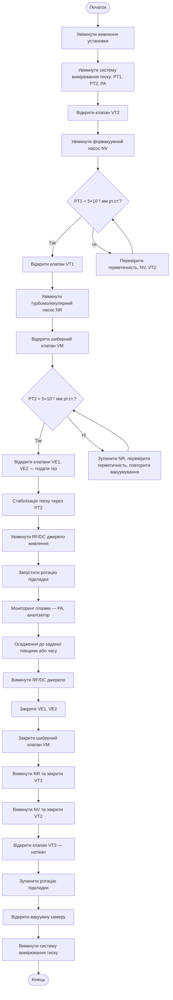

# DC-RF-Sputtering

```mermaid
graph TD

%% === ПОЧАТОК ===
Start([Початок]) --> P1[Увімкнути живлення установки]
P1 --> P2[Увімкнути систему вимірювання тиску: PT1, PT2, PA]

%% === ПОПЕРЕДНЄ ВІДКАЧУВАННЯ ===
P2 --> V1[Відкрити клапан VT2]
V1 --> V2[Увімкнути форвакуумний насос NV]
V2 --> C1{PT1 < 5×10⁻² мм рт.ст.?}

C1 -- Так --> H1[Відкрити клапан VT1]
C1 -- Ні --> Err1[Перевірити герметичність, NV, VT2]
Err1 --> C1

%% === ВИСОКИЙ ВАКУУМ ===
H1 --> H2[Увімкнути турбомолекулярний насос NR]
H2 --> H3[Відкрити шиберний клапан VM]
H3 --> C2{PT2 < 5×10⁻⁵ мм рт.ст.?}

C2 -- Так --> G1[Відкрити клапани VE1, VE2 — подати газ]
C2 -- Ні --> Err2[Зупинити NR, перевірити герметичність, повторити вакуумування]
Err2 --> C2

%% === ПОДАЧА ГАЗУ ТА ОСАДЖЕННЯ ===
G1 --> G2[Стабілізація тиску через PT2]
G2 --> G3[Увімкнути RF/DC джерело живлення]
G3 --> G4[Запустити ротацію підкладки]
G4 --> G5[Моніторинг плазми — PA, аналізатор]
G5 --> G6[Осадження до заданої товщини або часу]

%% === ЗАВЕРШЕННЯ ===
G6 --> Z1[Вимкнути RF/DC джерело]
Z1 --> Z2[Закрити VE1, VE2]
Z2 --> Z3[Закрити шиберний клапан VM]
Z3 --> Z4[Вимкнути NR та закрити VT1]
Z4 --> Z5[Вимкнути NV та закрити VT2]
Z5 --> Z6[Відкрити клапан VT3 — натікач]
Z6 --> Z7[Зупинити ротацію підкладки]
Z7 --> Z8[Відкрити вакуумну камеру]
Z8 --> Z9[Вимкнути систему вимірювання тиску]
Z9 --> End([Кінець])

```
